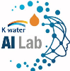

## AWS를 활용한 K-water AI-Lab Solution의 공유 및 활용

#### 1. 목적:

- AWS를 활용하여 개발된 AI Solutions의 효율적 공유 및 활용 Platforms 제공

#### 2. 접근방법:
- Approach-1. 개발된 Jupyter notebooks를 활용한 AI Solutions 실행 (ex: https://github.com/Kwater-AILab/algae_monitoring)
- Approach-2. Streamlit를 활용한 Web-App기반 AI Solution 실행 (https://share.streamlit.io/himount/algae-web/main/Algae_monitoring_streamlit.py)

#### 2.1 Approach-1: Jupyter notebook 실행 (In progress)

##### 2.1.1 고려사항:

1. 웹과 같이 지속적인 운영보다는 개발된 AI Solutions을 일시적 또는 일정기간 경험하며 실제 업무나 연구에 적용해 볼 수 있는 경험을 제공하는 것을 목적으로
   하기때문에 반드시 AWS의 활용은 시간비용으로 운영될 수 있도록 해야함 (Docker Container와 Lambda 등의 활용필요)
   
2. 사용자들이 Cloud Formation Link를 클릭할 때 Roles와 Policies에 대한 에러없이 Jupyter notebook이 실행되도록

##### 2.1.2 절차: 
* root user
1. Workshop 등 사용자 그룹 생성

2. 사용자수를 고려하여 그룹내 User 생성

3. S3에 CloudFormation을 upload하기
   - CloudFormation은 1) CloudFormation에 접근을 통한 Yaml파일의 실행
                      2) EC2생성 및 miniconda, Jupyter 및 nbextension 등의 설치 (shell script 사용)
                      3) S3생성을 통한 분석자료의 저장
    -> 사용자가 위의 절차를 실행시 이용가능하도록 Role 및 Policy 지정필요
   
4. 사용자별 IAM으로 생성된 계정정보 Table로 공유

* AI-Solutions user

1. 아래의 CloudFormation Link를 클릭

2. 로그인을 위한 계정정보 (ID, PW 등) 입력

3. CloudFormation의 설정에 따라 Jupyter notebook 실행

#### 2.2 Approach-2: Streamlit WebApp 실행 (Future Work)

#### 3. AWS 시작: K-water AI-Lab 아이콘을 클릭하세요

 |
**Seoul** (Click Kwater-AILab ICON to start Jupyter notebook for Workshop) 

#### 4. Workshop등 AWS이용 후 AWS이용 추가요금 방지를 위한 확인사항
